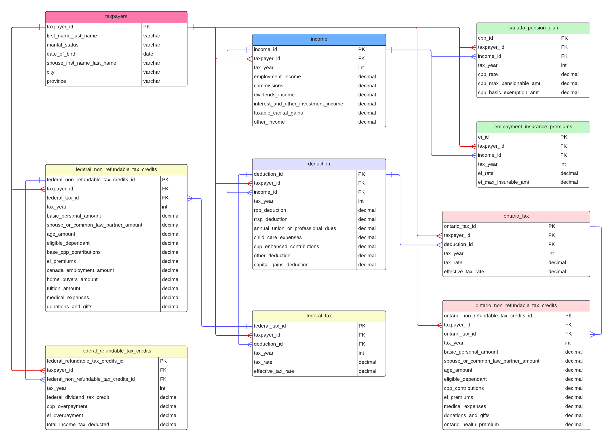

# Canadian Income Tax Estimation Database

The Canadian Income Tax Estimation Database is a high-level tool designed to facilitate tax estimation and financial analysis. It provides a simplified yet comprehensive set of tables, views, and queries, focusing on common income sources, deductions, and tax credits. Gain valuable insights into your income, tax credits, and tax liabilities for informed financial decisions. This user-friendly database provides a quick and insightful tax estimations.

## Features

- **Tables:** Includes tables for taxpayers' information, income details, Canada Pension Plan (CPP), Employment Insurance (EI) premiums, deductions, Federal tax, Federal non-refundable tax credits, Federal refundable tax credits, Ontario tax, Ontario non-refundable tax credits, and more.

- **Views:** Predefined views for Total Income, CPP Contribution, and EI Premiums provide valuable insights into taxpayers' financial profiles.

- **Queries:** Useful queries are available to retrieve specific information, such as CPP contributions and EI premiums for each taxpayer.

## Getting Started

1. **Create Database:** Execute the SQL script `create_tables.sql` to create all necessary tables, including primary and foreign keys.

2. **Insert Data:** Populate the database with sample data using scripts like `taxpayers_info.sql`, `income_info.sql`, and `constants_info.sql`.

3. **Views and Queries:** Explore predefined views (`view_total_income`, `view_cpp_contribution`, `view_ei_premiums`) and queries (`query_cpp.sql`, `query_ei.sql`, `query_combined_financial_info.sql`) for tax estimation and financial insights.

4. **Custom Queries:** Feel free to create additional queries based on your specific needs.

## ERD Diagram

## Acknowledgments

This project is created to simplify tax estimation for individuals. Contributions and improvements are welcome.

## Updating the Repository

This repository will be periodically updated to include additional views beyond CPP and EI calculations. The current data inserted covers the 2022 and 2023 tax years, but users can insert data for other tax years to run the database.

## License

This project is licensed under the [MIT License](LICENSE.md).
